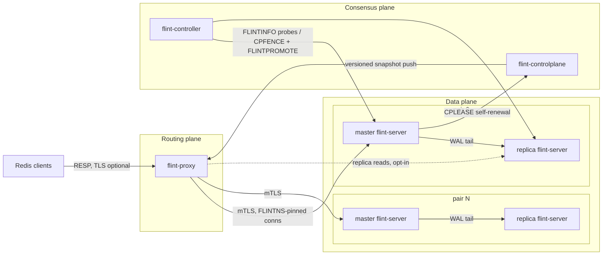
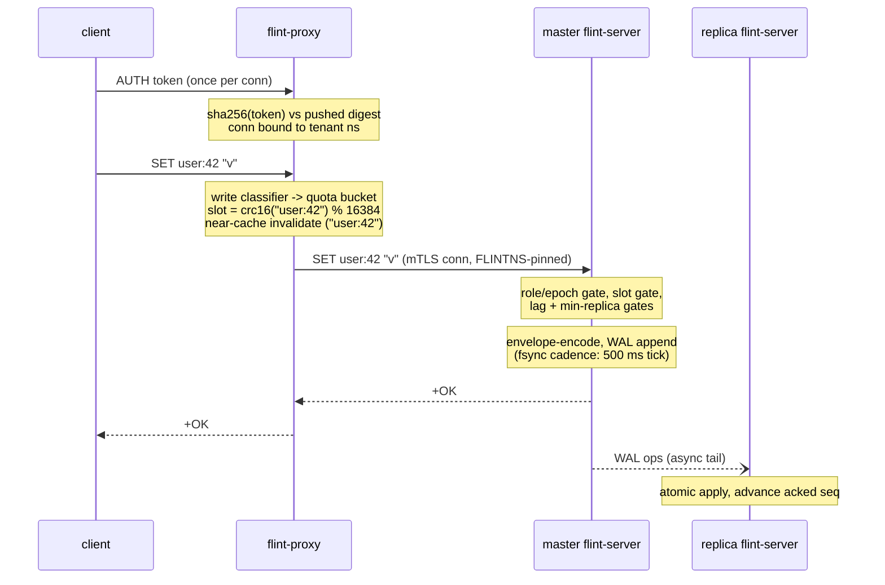
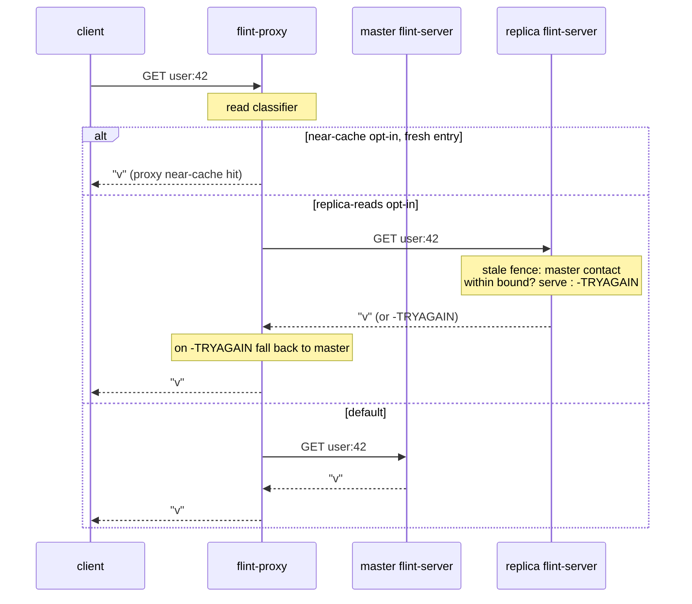

# Flint architecture

Flint is a persistent, disk-first cache that speaks the Redis protocol. This
document is the system-level map: the planes, what owns what, and the exact
path a normal write and a normal read take through the code in this
repository.

## The three planes

- **Routing plane — `flint-proxy`.** Stateless. Terminates client TLS,
  authenticates tenant tokens (comparing SHA-256 digests — the proxy never
  holds plaintext tokens at rest), hashes each key onto the Redis Cluster
  16,384-slot space, and forwards frames to the master of the owning pair
  over mutual-TLS connections pinned to the tenant's namespace. Everything
  it knows — pairs, slot ranges, tenants, quotas, opt-in flags — arrives as
  versioned snapshots pushed by the control plane; the proxy holds no
  durable state and any proxy can serve any tenant.
- **Consensus plane — `flint-controlplane` + `flint-controller`.** The
  control plane is the topology registry: pairs, slot ranges, tenants and
  their token digests, quotas, opt-ins. It runs as a persistent single node or
  Raft-replicated for HA, and pushes snapshots to proxies on change
  (suppressing no-op pushes). The controller supervises pairs — probe,
  verify, promote, fence — using **epoch fencing**: every role carries a
  `(generation, counter)` epoch, and a deposed master that comes back is
  fenced read-only by its own lease expiry. The lease lives at the control
  plane and each master renews it itself (`CPLEASE`, ADR-0018), so the
  fence survives any controller silence; every promotion first commits a
  durable fencing record there (`CPFENCE`), and an unrecorded promotion is
  refused back to read-only by the superseded record. A partition never
  yields two writable masters.
- **Data plane — `flint-server` pairs on `flint-storage`.** Each pair is a
  master and replica running the storage engine: Kvrocks-style envelope
  encoding over RocksDB on local NVMe (an in-memory engine serves
  development). The master appends every mutation to the RocksDB WAL;
  replicas tail that WAL over the mesh. Replication is asynchronous **with
  an enforced lag bound** — the loss window is a configuration knob, not an
  accident.

One rule ties the planes together: **data moves only through the proxy;
topology moves only through the control plane.** Nodes never gossip
routing; proxies never decide topology.

A second rule governs configuration: **anything per-tenant is a
control-plane fact, set dynamically and pushed — never a process flag.**
The tenant opt-ins ('r' replica reads, 'c' near-cache, 'q' over-quota,
'f' federated, 'a' async writes) all follow it: one CP command, one
snapshot push, no restarts anywhere. Quota state applies to every
connection immediately; the AUTH-bound opt-ins apply to connections
authed after the push (a connection's semantics never change
mid-stream). Per-process knobs (lag caps, queue cap, fsync cadence)
either get a runtime admin command or accept the rolling-restart path —
a new tenant-scoped setting must not.

## A normal write

`SET user:42 "v"` from a tenant's off-the-shelf Redis client:

Step by step:

1. **Edge.** The client authenticates once per connection. The proxy hashes
   the presented token and compares digests; the connection is bound to the
   tenant's namespace and its grant flags (quota, replica-reads, cache).
2. **Admission.** The shared read/write classifier (`flint-commands` — one
   table used by every plane) marks SET a write. Writes pass the tenant's
   token-bucket rate quota; an over-quota tenant gets `-QUOTA` on writes
   while space-*reducing* commands (DEL, EXPIRE, FLUSHALL) stay exempt so a
   full tenant can always dig itself out.
3. **Routing.** `slot = crc16(key) mod 16384` (hash tags supported); the
   slot maps to a pair via the pushed ranges; the frame forwards unmodified
   on a mutual-TLS connection already pinned to the namespace by a FLINTNS
   handshake at open. If the tenant uses the proxy near-cache, the written
   key is invalidated before forwarding.
4. **The master's gates,** in order: role (a replica answers `-READONLY`),
   epoch/lease (a fenced ex-master refuses), slot ownership (a migrated
   slot answers `-MOVED`, mid-migration writes shed `-TRYAGAIN`), then the
   loss-protection gates — if replication lag exceeds the soft cap
   the write is *delayed*, past the hard cap it is *shed* with
   `-THROTTLED` (this is what makes the loss window a bound, not a hope),
   and `min-replicas-to-write` can require live replicas before accepting.
5. **Apply.** The dispatcher encodes the mutation through the envelope
   layer (namespace-prefixed, so tenants are physically disjoint key
   ranges) and commits it to RocksDB with the WAL. The WAL is fsynced by
   a **bounded cadence** (`--wal-fsync-ms`, default 500 ms — one group
   commit covering everything since the last tick), so the write hits
   stable storage within half a second of its ack without paying a
   per-write fsync.
6. **Ack.** The client's `+OK` means: applied, and in the WAL. It
   survives a crash and restart of the master process (the OS holds the
   WAL pages — proven by every kill -9 drill). The loss window of a
   whole-HOST failure (power, kernel, instance) is bounded by the fsync
   cadence; the loss window of a failover is bounded by the replication
   lag cap (step 4). Every window is a knob, not a hope.
7. **Replicate (async).** The replica tails the master's WAL over mTLS and
   applies batches atomically, advancing its acked sequence; the master
   tracks `seq_lag`/`lag_ms` per replica, which feed the gates in step 4
   and the failover RPO. On master death the controller verifies, promotes
   the replica with a bumped epoch, and the proxy re-discovers the new
   master — clients keep one endpoint throughout.

## A normal read

`GET user:42`:

1. **Default path: the master.** Reads route exactly like writes — slot to
   pair to master — so a tenant that opted into nothing gets
   read-your-writes within one connection by construction.
2. **Proxy near-cache (opt-in per tenant).** A bounded-memory,
   short-TTL cache at the proxy for GET-shaped reads, invalidated by
   writes passing through the same proxy and capped per tenant by a
   fairness budget. The tenant's opt-in flag is consent to the TTL-bounded
   staleness contract.
3. **Replica reads (opt-in per tenant).** Read commands may route to the
   pair's replica. The replica **self-fences stale reads**: it serves only
   while it has heard from the master within a staleness bound (the master
   keepalives the sync stream when idle); past the bound it answers
   `-TRYAGAIN` and the proxy transparently falls back to the master. A
   partitioned replica can never silently serve old data.
4. **On the node,** a read resolves the namespace-prefixed envelope key,
   checks liveness (an expired TTL deletes on touch), and answers from
   RocksDB — the working set's hot pages sit in the OS page cache and the
   block cache, which is where "disk-first" keeps RAM-class latency for
   hot keys while the long tail lives on NVMe.

## Failover

Failover — master handoff (planned graceful, and unexpected
crash/partition), the epoch-fencing + lease + lag-cap invariants it rests
on, why two masters can never serve the same slot, and the stateless
proxy-instance failure case — has its own map in
[failover.md](failover.md).

## Where the invariants are proven

Every claim above has a runnable proof in `tools/`: replication parity and
lag (`repl_drill.sh`), epoch-fenced failover with a zombie master
(`failover_drill.sh`), one-endpoint routing across migration and failover
(`proxy_drill.sh`), the stale-read fence (`replica_stale_fence_drill.sh`),
quota enforcement (`tenant_quota_drill.sh`), rotation under live traffic
(`token_rotation_drill.sh`, `cert_reload_fleet_drill.sh`), and randomized
kill-loops with a ledger oracle (`chaos_drill.sh`,
`proxy_chaos_drill.sh`). Command semantics are gated by
`flint-conformance` against a real Valkey.
