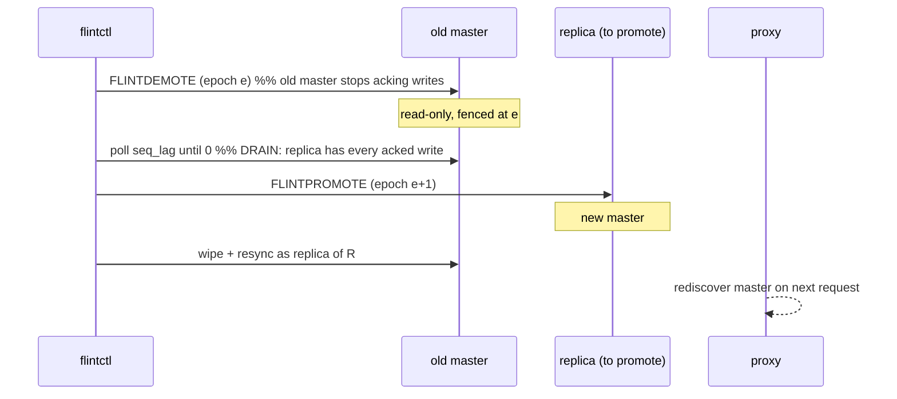

# Failover — design

How Flint survives the loss of an instance. Most of this doc is **master
failover** — moving the master role within a pair without losing
acknowledged writes, without ever running two masters, and without the
client seeing more than a brief latency bump — because that is the case
with data and a role at stake. A **proxy** instance failure (stateless, no
data at risk) is the short section near the end.

Master failover has two paths sharing one safety foundation:

- **Planned** — an operator hands the role off gracefully (maintenance,
  node decommission, rolling upgrade): `flintctl failover <node>`.
- **Unexpected** — a master crashes or is partitioned away: the
  `flint-controller` detects it and promotes the survivor.

Both end the same way — one master, at a higher epoch, with the proxy
routing to it and the old master rejoined (or fenced) as a replica.

## The safety foundation

Four mechanisms make both paths safe. They are invariants, not policy —
the failover code rests on them rather than re-deriving them.

### Epoch fencing

Every role carries a `(generation, counter)` **epoch**, persisted in the
node's manifest. A promotion always claims an epoch **strictly greater**
than anything either member has seen; `FLINTPROMOTE`/`FLINTDEMOTE` refuse
a claim that is not an increase (`-FENCED`). Consequence: a deposed
master that comes back — a "zombie" — cannot reclaim the role, because
its manifest epoch is now behind the lineage. The controller also
actively fences any other node still claiming master (`FLINTDEMOTE` it).
This is what makes "two masters" structurally impossible rather than
merely unlikely.

### Leases (the partition guard)

A managed master holds a **lease** the controller renews every tick
(`FLINTLEASE <ttl_ms>`). A master that stops hearing renewals — because
it is partitioned away from every controller — **self-fences to
read-only** when the lease deadline passes (`--lease-ttl-ms`, default
3000). So a partitioned master stops accepting writes *on its own*,
before any successor is promoted. The controller only renews the lease of
a master it can see AND that is converged (a live replica, `seq_lag==0`),
so it never keeps a doomed master alive. A standalone (unmanaged) node
has no lease and never self-fences.

### min-replicas-to-write (the widowed-master guard)

The lag cap (below) bounds loss *while a replica exists* — but with no
live replica there is no lag to measure, so an isolated master could
otherwise accept unbounded at-risk writes. `min-replicas-to-write`
(default 0; set to 1 on a replicated pair) sheds writes with `-THROTTLED`
while fewer than N replicas are live. Together with the lease this closes
the widowed-master hole.

### The lag cap (the RPO bound)

Replication is asynchronous, but the master **sheds writes**
(`-THROTTLED`) once replica lag exceeds `--lag-hard-ms` (default 1000; a
soft cap delays first). So the window of acknowledged-but-unreplicated
writes — everything a failover could lose — is a configuration bound, not
an accident. All four knobs above hot-reload (`flintctl reload`), so an
operator can tighten them under load without a restart.

## Planned failover

`flintctl failover <node>` (also the last phase of `flintctl upgrade`,
and the prerequisite to decommissioning a master). The core is **demote
before promote** — the ordering is loss-critical:



1. **Demote first.** The old master goes read-only and stops acking. A
   *promote-first* ordering would open a window where the proxy still
   routes to the old master, which acks writes the new lineage never
   contains — the classic lost-write bug. Demote-first forecloses it.
2. **Drain.** Wait until the old master reports `seq_lag == 0`: its
   replica has applied every acknowledged write. This also guarantees the
   promotion target is caught up, so a lagging replica can never freeze an
   incomplete dataset.
3. **Promote** the replica at the next epoch.
4. **Rejoin.** The ex-master wipes and full-syncs back as a fresh replica
   of the new master (an ex-master's replication cursor is not a tail
   position, so it never warm-rejoins — the demote contract is
   wipe + checkpoint resync). `FLINTDEMOTE` records this itself, leaving a
   `NEEDS_RESEED` marker in the data dir, so the wipe happens no matter
   which tool restarts the seat. Starting the node **without**
   `--replica-of` clears the marker instead: it is being started as the
   lineage, not as a tailer.

**The same marker covers replication falling too far behind.** A replica
whose cursor has aged out of the master's retained WAL cannot catch up by
reconnecting — the bytes it needs no longer exist. It marks itself and
exits non-zero rather than retrying forever (under systemd's
`Restart=on-failure` the next start re-seeds unattended). Before this, such
a node reconnected once a second indefinitely while the master went on
counting it as a live replica: a pair that looked protected and was not.
`reseed_drill.sh` covers both directions, including the case that must NOT
re-seed — an ordinary warm restart still resumes from its durable cursor.

**Guarantee: zero acknowledged-write loss.** The no-master gap between
demote and promote is sub-second and absorbed by the proxy's retry budget
— latency, not error, and not loss (the drain moved every acked write
first). Proven by `decommission_drill.sh` with a live writer.

## Unexpected failover

The `flint-controller` supervises each pair: **detect → verify → promote
→ fence**, epoch-fenced throughout. It is stateless (its truth is the
nodes' manifests + the fleet journal), so it can crash and restart, or
run as an HA set where any survivor acts.

```mermaid
flowchart LR
    A[probe FLINTINFO<br/>every --poll-ms] --> B{master reachable?}
    B -- yes --> C[renew lease if converged<br/>fence any zombie master]
    B -- no, for --confirm ticks --> D{pair converged<br/>within --max-stale-ms?}
    D -- no --> E[REFUSE + page<br/>degraded: needs spare/S3]
    D -- yes --> F[promote highest-epoch<br/>survivor at epoch+1]
    F --> G[attach fresh replacement<br/>replica; proxy rediscovers]
```

- **Detect.** The controller polls each node's `FLINTINFO` every
  `--poll-ms` (default 200). A master is declared down only after
  `--confirm` consecutive missed ticks (default 3) — a transient blip
  never triggers a failover. ~600 ms to a confirmed detection at the
  defaults.
- **Verify.** Before promoting it checks the pair is **converged** — a
  survivor observed at `seq_lag == 0` within `--max-stale-ms` (default
  5000). If no survivor is caught up (both nodes died, or the replica
  never converged), the controller **refuses and pages** rather than
  freeze an incomplete dataset — a whole-pair loss is a spare-restore /
  S3 event, not a promotion.
- **Promote.** The survivor with the **highest epoch** (ties broken
  deterministically by address, so an HA controller set agrees) is
  promoted at `max_epoch + 1`. Two controllers racing is safe: the second
  `FLINTPROMOTE` gets `-FENCED` because the outcome already exists.
- **Fence + replace.** A returning old master is fenced by its stale
  epoch (and demoted if it claims master); a fresh replacement replica is
  attached and full-syncs from the new master.

**RPO.** Bounded by the lag cap: a crash loses at most the async tail
below `--lag-hard-ms` (default ≤ 1 s), and only writes that were acked
after the last replicated one. A replica kill loses nothing (the master
is untouched). **RTO.** Detection + verify + promote + proxy rediscovery;
drill-measured **~0.6–1.2 s** from master kill to writable again at the
defaults.

## Failure scenarios

| scenario | response | client impact | loss |
|---|---|---|---|
| Master process crashes (replica live) | controller confirms, promotes the converged replica, attaches a fresh replica | brief retry (proxy chases) | ≤ lag-hard tail |
| Master + replica both crash | controller REFUSES (not converged), pages; spare-restore from durable snapshot | writes unavailable until restore | up to last snapshot (rare) |
| Network partition strands the master | master self-fences read-only on lease expiry; controller promotes the reachable survivor | brief retry; reads may `-TRYAGAIN` then fall back | ≤ lag-hard tail |
| Old master returns after promotion | fenced by stale epoch; demoted; rejoins as fresh replica | none | none |
| Controller itself dies | data plane keeps serving; leases still expire so no zombie master; any HA-set survivor resumes supervision | none (a *new* failure during the gap waits for a controller) | none |
| Planned handoff (maintenance/upgrade) | `flintctl failover`: demote → drain → promote | brief retry | **zero** (drained) |
| Customer-style reboot of a node | warm restart: data intact on NVMe, WAL replay, back in ~seconds | brief retry if it was master | none |

## What the client sees

Nothing but latency. The proxy holds one stable endpoint; on a backend
error, `-READONLY` (a demoted-in-place ex-master), or `-MOVED`, it
rediscovers the pair's current master and retries within a bounded budget.
`-TRYAGAIN` from a stale-fenced replica read transparently falls back to
the master. The client keeps its connection and its endpoint across every
scenario above.

## No split-brain — the argument

Two masters accepting writes for the same slot is impossible because a new
master's epoch strictly exceeds the old one's, `FLINTPROMOTE`/`FLINTDEMOTE`
reject non-increasing epochs, a partitioned old master self-fences on
lease expiry (so it cannot serve writes while unreachable), and the proxy
routes by the master it rediscovers — never two at once. Every layer
(manifest epoch, node lease, controller promotion, proxy routing) agrees
on a single lineage, and each is independently fenced.

## Proxy instance failure (the stateless contrast)

A master carries data and a role, so its failure needs epochs, leases, and
a promotion. A **proxy carries neither** — it is stateless by design, and
its failure is correspondingly boring: no data is at risk, no election
happens, and recovery is a client reconnect plus (optionally) a fresh
instance.

- **Nothing durable is lost.** All a proxy holds is pushed, ephemeral
  state: the topology, tenants, token digests, quotas, and opt-in flags
  that arrive as versioned snapshots from the control plane (`CPWATCH`).
  The only thing that dies with a proxy is its **near-cache** — bounded,
  short-TTL, invalidate-on-write — so losing it is a warm-up cost on the
  survivors, never a correctness event.
- **A tenant is served by a subset, not one proxy.** Each tenant is
  assigned a **shuffle-shard subset** of the proxy fleet (`k` proxies,
  default 2; `CPSETSUBSET` overrides for whale isolation), and its
  endpoint publishes to that subset (per-tenant DNS). One proxy dying
  removes one address from the tenant's endpoint; the client's next
  connection lands on another subset member, which already serves that
  tenant from its own snapshot.
- **In-flight requests retry, not fail permanently.** Requests on the
  dead proxy get a connection error; the client reconnects (to another
  subset member) and retries. Because reads route to the master by
  default, read-your-writes still holds across the reconnect. A read that
  had been answered from the dead proxy's near-cache is simply re-fetched.
- **A replacement is a cold start, not a rebuild.** A new proxy boots in
  control-plane mode, subscribes with `CPWATCH`, and receives a
  **filtered** snapshot (only its assigned tenants — a proxy never holds
  tokens it does not serve). It routes correctly **from its first
  snapshot**: `slot_map_drill` shows a cold proxy serving fragmented slot
  ownership with `moved_learned_total = 0` — no `-MOVED` chasing needed to
  be correct. It then warms its near-cache and learns any migration
  bridges over time; those are latency optimizations, not correctness
  prerequisites.

Detection and replacement are the fleet's job, not the data path's: the
control plane suppresses no-op pushes, and the operator/agent re-adds a
proxy (or an autoscaling group replaces the instance). Until then, the
tenant's other subset proxies carry the load.

**The single-VM shape.** The marketplace entry SKU runs one proxy on the
instance, so a proxy failure there is an *instance* failure — recovered by
replacing the instance (an ASG or a fresh launch), after which the fleet
bootstraps back and the proxy rejoins with a cold-start snapshot. The
subset failover above is the multi-proxy / managed shape, where a single
proxy loss is invisible to clients.

| scenario | response | client impact | loss |
|---|---|---|---|
| One proxy in a multi-proxy subset dies | client reconnects to another subset member; agent/operator replaces the instance | brief reconnect + retry; a cold near-cache warms up | none |
| A replacement proxy joins | `CPWATCH` snapshot → serves from the first frame | none | none |
| Single-VM proxy (== instance) dies | replace the instance; fleet re-bootstraps, proxy rejoins cold | unavailable until the instance is back | none (data on NVMe) |

## Where it is proven

- `failover_drill.sh` — epoch-fenced promotion; a returning zombie master
  with a stale manifest cannot reclaim the role.
- `controller_drill.sh` — kill → auto-promotion wall clock (RTO), data
  intact, post-promotion write survives restart.
- `lease_drill.sh` — a master partitioned from controllers self-demotes
  on lease expiry.
- `min_replicas_drill.sh` — the widowed-master write gate.
- `decommission_drill.sh` — planned failover with a live writer: zero
  acked-write loss, ex-master rejoins.
- `chaos_drill.sh` / `proxy_chaos_drill.sh` — thousands of randomized
  kills with a ledger oracle: every acked write accounted for, zero
  corruption, zero double-ownership, through both direct and
  client→proxy→node paths.
- `slot_map_drill.sh` — a cold proxy routes fragmented slot ownership
  correctly from its first snapshot (`moved_learned_total = 0`), the
  proxy-replacement guarantee.
- `proxy_drill.sh` — one endpoint absorbs migration and failover; the
  client never sees `-MOVED`/`-ASK`.
