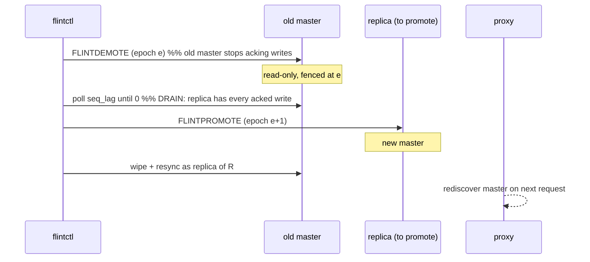
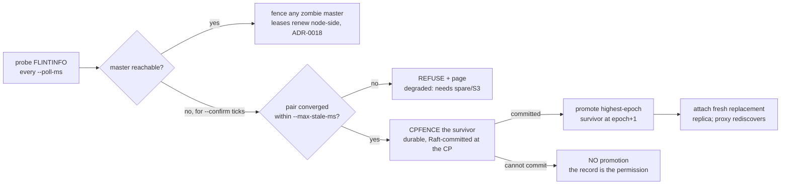

# Failover — design

How Flint survives the loss of an instance. Most of this doc is **master
failover** — moving the master role within a pair without losing
acknowledged writes, without ever running two masters, and without the
client seeing more than a brief latency bump — because that is the case
with data and a role at stake. A **proxy** instance failure (stateless, no
data at risk) is the short section near the end.

Master failover has two paths sharing one safety foundation:

- **Planned** — an operator hands the role off gracefully (maintenance,
  node decommission, rolling upgrade): `flintctl failover <node>`.
- **Unexpected** — a master crashes or is partitioned away: the
  `flint-controller` detects it and promotes the survivor.

Both end the same way — one master, at a higher epoch, with the proxy
routing to it and the old master rejoined (or fenced) as a replica.

## The safety foundation

Four mechanisms make both paths safe. They are invariants, not policy —
the failover code rests on them rather than re-deriving them.

### Epoch fencing

Every role carries a `(generation, counter)` **epoch**, persisted in the
node's manifest. A promotion always claims an epoch **strictly greater**
than anything either member has seen; `FLINTPROMOTE`/`FLINTDEMOTE` refuse
a claim that is not an increase (`-FENCED`). Consequence: a deposed
master that comes back — a "zombie" — cannot reclaim the role, because
its manifest epoch is now behind the lineage. The controller also
actively fences any other node still claiming master (`FLINTDEMOTE` it).
This is what makes "two masters" structurally impossible rather than
merely unlikely.

### Leases (the partition guard)

A serving master holds a **lease at the control plane** and renews it
ITSELF: `CPLEASE <self-addr>` every `ttl/3` against the CP it already
journals to (ADR-0018). Two things fence it:

- **It cannot reach the CP.** The deadline passes (`--lease-ttl-ms`,
  default 5000 — sized so a routine CP leader election, ~2.4 s of the
  lease path dark, rides through on renewal retries) and it **self-fences
  to read-only** — it cannot rule out
  a promotion committed on the other side of the split. So a partitioned
  master stops accepting writes *on its own*, before any successor is
  promoted.
- **A promotion is on record over it.** Every promotion commits a durable
  fencing record at the CP first (`CPFENCE`, see below); the superseded
  master's next renewal is answered `-SUPERSEDED` and it fences
  immediately — within one renewal interval, faster than TTL expiry.

The lease used to be pushed by the controller (`FLINTLEASE` per tick),
which anchored the fence to a single unquorumed process: every mode of
controller silence — a stall, a crash-loop, a quiet hang — fenced every
healthy master fleet-wide (#168, #171, #172, all found by the S2.2 scale
runs). Under ADR-0018 a silent controller costs only failover capability;
the fleet keeps serving. A standalone node (no CP, or `--lease-ttl-ms
0`) has no lease and never self-fences.

### min-replicas-to-write (the widowed-master guard)

The lag cap (below) bounds loss *while a replica exists* — but with no
live replica there is no lag to measure, so an isolated master could
otherwise accept unbounded at-risk writes. `min-replicas-to-write` sheds
writes with `-THROTTLED` while fewer than N replicas are live. Together
with the lease this closes the widowed-master hole.

**You set it, Flint honours it, at any value** — as a `min-replicas` line
in the inventory, as `--min-replicas-to-write` on a seat, or live with no
restart:

```sh
valkey-cli -p 7001 FLINTCONFIG min-replicas-to-write 1
valkey-cli -p 7001 FLINTCONFIG | grep min-replicas-to-write   # confirm
```

What you get:

| Value | Behaviour |
|---|---|
| **0** (shipped, = Redis) | Writes are never blocked on replica health. A widowed master keeps accepting; those writes are at risk until the widowed grace below sheds them. |
| **1+** | Writes shed with `-THROTTLED` whenever fewer than N replicas are live — including the window after a failover, until the replacement finishes its full sync. |

Both arms run in the gate on every build
(`tools/replica_starvation_drill.sh`): with the guard on, a frozen replica
drives the master into backpressure and stays inside the WAL window; with
the shipped default, the master accepts every write with no live replica,
as designed. So the table above is asserted, not just described.

**It stays off by default, and the reason is worth knowing.** Setting it
to 1 does close the hole, but a **freshly promoted master has no replica
either**, and the gate cannot tell "the peer died" from "I was just
promoted": it would shed every write until a replacement attaches *and*
acks, which on a large dataset means the whole full-sync. That trades
failover RTO for durability on every single failover — the same reason
Redis ships `min-replicas-to-write 0`. Set it to 1 only when a write
outage is genuinely preferable to losing acked writes.

The gate that IS on by default for pair members is the widowed grace,
below, which buys the same bound without that trade.

### The widowed grace (the bound on how long you can be alone)

`--widowed-grace-ms` is how long a node may keep accepting writes while
**no replica has acked at all**. Past it, writes are shed with
`-THROTTLED`; the moment a replica acks again the gate lifts on its own,
with no restart.

This is the gate that makes the loss bound real in the one state where
every other mechanism is blind. With no live replica `lag_ms` is `None`,
so the lag cap cannot fire — it has nothing to measure — and the write
path falls through to no backpressure at all. Before this existed, a
default pair whose replica was frozen shed 88 writes while the replica
was still inside the 2 s liveness window and then accepted **539 more in
~4 s** with zero replicas, unbounded and climbing. Every shipped cluster
was in that state.

- **flintctl sets it to 10 000 ms on pair members**, matching the
  published RPO envelope, and leaves it off for a seat with no peer — a
  standalone node must not be punished for redundancy it was never
  configured to have. Set `widowed-grace-ms` in the inventory to choose
  another value; `0` restores the old unbounded behaviour.
- It has to be decided by flintctl rather than the server, because from
  inside the process a lone node and a pair member that just lost its
  peer look identical. Only the inventory knows which one you have.
- `FLINTINFO` reports `widowed_grace_ms` and `widowed_shed`, so during
  an incident "the knob is set" and "the knob is biting" are separate,
  checkable facts.

Size it comfortably above a promotion plus the replacement replica's
first ack, and below the loss you are willing to publish.
`tools/widowed_grace_drill.sh` holds all four properties in the gate.

### The lag cap (the RPO bound)

Replication is asynchronous, but the master **sheds writes**
(`-THROTTLED`) once replica lag exceeds `--lag-hard-ms` (default 1000; a
soft cap delays first). So the set of acknowledged-but-unreplicated
writes — everything a failover could lose — is a configuration bound, not
an accident. All four knobs above hot-reload (`flintctl reload`), so an
operator can tighten them under load without a restart.

**Read that bound carefully: it bounds VOLUME, not age.** Every mechanism
on this page — the lag cap, the min-replicas gate, the lease — works by
deciding *when the master stops accepting new writes*. None of them can
reach back and protect a write that was already acknowledged. Once a
write is acked and replication then stalls, that write stays at risk for
as long as the stall lasts, and its age at the moment of a crash is
bounded by nothing.

So the honest statement is: **at most one cap-window's worth of writes is
ever at risk**, because past the cap the master stops adding to the pile.
The oldest write in that pile can be far older than the cap.

This was measured, not reasoned about. `flint-chaos --stall-replica-ms`
freezes the replica with SIGSTOP so the master acks writes it cannot
replicate:

| stall | deepest acked-write loss |
|---|---|
| none | 0 ms |
| 700 ms (under the 1000 ms cap) | 543 ms |
| 1800 ms (over the cap) | ~1.7 s — *older than the cap* |

The third row is not a bug being caught. It reproduces identically under
both the harness and controller drivers, and with `min-replicas 1`: every
gate did its job, and the write still aged past the cap because nothing
bounds age. Wording that promised "at most N seconds of acked writes"
described a guarantee no code here provides, and has been corrected to
the volume form above.

**And the volume half was measured too**, because a claim that rests on
"past the cap the master stops accepting" is worth nothing if the cap
never actually bites. Same stall, same seed, only the cap changed:

| stall | lag cap | writes shed `-THROTTLED` | deepest acked-write loss |
|---|---|---|---|
| 1800 ms | 1000 ms | 75 | 1757 ms |
| 1800 ms | **200 ms** | **140** | 1753 ms |

Both halves of the statement are visible in those two rows. Tightening the
cap fivefold nearly doubled the shedding — the master really does stop
adding to the pile, and sooner — while the age of the oldest lost write
did not move, because it is set by how long replication was stalled and
not by the cap. A reader who takes only one thing from this section should
take that: **the cap is a valve on what is still arriving, never a rescue
for what was already acked.**

Reproduce with:

```sh
flint-chaos --iterations 6 --keys 300 --seed 5 --mode mixed \
  --stall-replica-ms 1800 --lag-hard-ms 200
```

`--stall-replica-ms` uses SIGSTOP on the replica process, so it works only
against a local cluster; the multi-host runner cannot exercise this path
and says so rather than reporting a quiet pass.

## Planned failover

`flintctl failover <node>` (also the last phase of `flintctl upgrade`,
and the prerequisite to decommissioning a master). The core is **demote
before promote** — the ordering is loss-critical:



1. **Demote first.** The old master goes read-only and stops acking. A
   *promote-first* ordering would open a window where the proxy still
   routes to the old master, which acks writes the new lineage never
   contains — the classic lost-write bug. Demote-first forecloses it.
2. **Drain.** Wait until the old master reports `seq_lag == 0`: its
   replica has applied every acknowledged write. This also guarantees the
   promotion target is caught up, so a lagging replica can never freeze an
   incomplete dataset.
3. **Promote** the replica at the next epoch.
4. **Rejoin.** An ex-master's replication cursor is not a tail position,
   so it never warm-rejoins as-is. `FLINTDEMOTE` records this itself,
   leaving a `NEEDS_RESEED` marker in the data dir, so the contract holds
   no matter which tool restarts the seat. Starting the node **without**
   `--replica-of` clears the marker instead: it is being started as the
   lineage, not as a tailer.

   The marked rejoin has a cheap path and a fallback. Every `FLINTPROMOTE`
   durably records the **promotion fence** — the new master's applied
   sequence at the instant it claimed the role, i.e. where the timelines
   branched — and every snapshot a master takes carries its role epoch in
   the id. A marked node started with `--rewind-snaps <dir>` asks the new
   master (`FLINTFENCE <epoch>`) for the highest sequence it vouches for,
   **rewinds** to its own newest local snapshot at or before that fence
   (hard links, not a transfer), and tails the difference — so rejoin
   catch-up is bounded by the snapshot cadence, not the dataset. Only when
   no safe snapshot exists does it fall back to the wipe + checkpoint
   full sync. The master re-checks the same fence when the tail attaches
   (`FLINTSYNC` carries the replica's claim epoch; past-the-fence cursors
   are refused), so a promotion racing the rejoin downgrades it to a
   re-seed rather than resurrecting an abandoned branch. This is what
   keeps failover recovery time independent of how much data the pair
   holds (#187): before it, the widowed new master could shed writes for
   an entire dataset-sized transfer. `rewind_rejoin_drill.sh` proves both
   the rewind and the refusal.

**The same marker covers replication falling too far behind.** A replica
whose cursor has aged out of the master's retained WAL cannot catch up by
reconnecting — the bytes it needs no longer exist. It marks itself and
exits non-zero rather than retrying forever (under systemd's
`Restart=on-failure` the next start re-seeds unattended). Before this, such
a node reconnected once a second indefinitely while the master went on
counting it as a live replica: a pair that looked protected and was not.
`reseed_drill.sh` covers both directions, including the case that must NOT
re-seed — an ordinary warm restart still resumes from its durable cursor.

**Guarantee: zero acknowledged-write loss.** The no-master gap between
demote and promote is sub-second and absorbed by the proxy's retry budget
— latency, not error, and not loss (the drain moved every acked write
first). Proven by `decommission_drill.sh` with a live writer.

## Unexpected failover

The `flint-controller` supervises each pair: **detect → verify → fence →
promote**, epoch-fenced throughout. It is stateless (its truth is the
nodes' manifests + the fleet journal), so it can crash and restart, or
run as an HA set where any survivor acts.



- **Detect.** The controller polls each node's `FLINTINFO` every
  `--poll-ms` (default 100). A master is declared down only after
  `--confirm` consecutive missed ticks (default 3) — a transient blip
  never triggers a failover. ~300 ms to a confirmed detection at the
  defaults.

  `confirm 3` is deliberate, and `confirm 2` was measured rather than
  assumed. On a 7-host cluster under load through the edge, a 300 s soak
  with **nothing killed** recorded zero spurious promotions at both
  settings (68,665 and 69,294 writes respectively) — the counter was first
  shown to move by killing a real master, so the zeros mean something.

  We still ship 3. `confirm` is the tolerance for a transient miss, and
  dropping to 2 spends a full miss of it to buy 100 ms of detection —
  against a measured RTO of 506–757 ms across real-network runs and a
  published `≤ 2 s` bound, which is already met with better than 2×
  margin. A clean five-minute window on a
  same-subnet fleet is also close to the best case for a failure mode
  driven by tails: GC pauses, scheduler hiccups, packet-loss bursts. Worth
  revisiting only if RTO becomes the binding constraint, and then on
  evidence from adverse conditions (controller-host CPU contention,
  cross-AZ RTT), not a longer quiet run.
- **Record + notify.** Before any `FLINTPROMOTE`, the promoter commits
  the fencing record at the control plane: `CPFENCE <survivor>`, durable
  and Raft-committed (ADR-0018). A promotion that cannot commit its
  record does not happen — an unrecorded promotion would just be
  `-SUPERSEDED` back to read-only by the stale record within a renewal
  interval. The commit also bumps the CP's version and wakes every proxy
  parked in `CPWATCH` (subsuming the old best-effort `CPPROMOTED` hint).
  The wake is still a HINT to re-probe, not a routing instruction: the
  proxy still asks the pair who claims master and believes the
  epoch-fenced answer, so a stale hint costs one probe and cannot
  misroute a write. `flintctl failover` and `flintctl upgrade` commit the
  same record, where the push matters most: a planned handoff demotes the
  old master in place, so it stays up answering `-READONLY` and a proxy's
  only other signal is a client write bouncing off it. Measured on
  loopback, the first write after a handoff costs ~+62 ms above steady
  state without the push and ~+6 ms with it
  (`tools/promote_notice_drill.sh`).
- **Verify.** Before promoting it checks the pair is **converged** — a
  survivor observed at `seq_lag == 0` within `--max-stale-ms` (default
  5000). If no survivor is caught up (both nodes died, or the replica
  never converged), the controller **refuses and pages** rather than
  freeze an incomplete dataset — a whole-pair loss is a spare-restore /
  S3 event, not a promotion.
- **Promote.** The survivor with the **highest epoch** (ties broken
  deterministically by address, so an HA controller set agrees) is
  promoted at `max_epoch + 1`. Two controllers racing is safe: the second
  `FLINTPROMOTE` gets `-FENCED` because the outcome already exists.
- **Fence + replace.** A returning old master is fenced by its stale
  epoch (and demoted if it claims master); a fresh replacement replica is
  attached and full-syncs from the new master.

**RPO.** A crash loses at most one cap-window's worth of writes — the
async tail the master accepted before lag reached `--lag-hard-ms`
(default 1000) — and only writes acked after the last replicated one. The
CAP is what bounds how much is at risk; it does **not** bound how old the
oldest at-risk write is, which grows with the length of the replication
stall (see "the lag cap" above for the measurements). A replica kill
loses nothing (the master is untouched). **RTO.** Detection + verify +
promote + proxy rediscovery. Measured kill→writable at the defaults:
**~0.4–0.5 s on loopback** (`flint-chaos --driver controller`, p50
404 ms over 14 promotions with a writer hammering through the kill;
`controller_drill.sh` reads 514 ms p50 idle, the difference being a
fresh client process per probe) and **757 ms on a 7-host cluster over a
real network**. Quote a real-network figure, never loopback. slo.md
carries the current one (rc.28, 5 hosts: p50 506 ms, worst 586 ms); this
7-host number is the conservative end of the same class, not a different
kind of measurement.

Through the proxy edge a client sees **no outage at all** — the proxy
chases the promotion underneath, so the workload records a slower write
rather than an error. The numbers above are the direct-to-master path.

## Failure scenarios

| scenario | response | client impact | loss |
|---|---|---|---|
| Master process crashes (replica live) | controller confirms, promotes the converged replica, attaches a fresh replica | brief retry (proxy chases) | ≤ one lag-hard window of writes |
| Master + replica both crash | controller REFUSES (not converged), pages; spare-restore from durable snapshot | writes unavailable until restore | up to last snapshot (rare) |
| Network partition strands the master | master self-fences read-only on lease expiry; controller promotes the reachable survivor | brief retry; reads may `-TRYAGAIN` then fall back | ≤ one lag-hard window of writes |
| Replica dies, master keeps serving | controller attaches a fresh replica; master is widowed until it syncs | none, then `-THROTTLED` if it is still alone when the grace expires | ≤ `--widowed-grace-ms` worth (10 s on a pair by default) — the lag cap is blind here, so this gate is the whole bound |
| Old master returns after promotion | fenced by stale epoch; demoted; rejoins as fresh replica | none | none |
| Controller itself dies | data plane keeps serving indefinitely — masters renew their own leases at the CP, so nothing fences; any HA-set survivor resumes supervision | none (a *new* failure during the gap waits for a controller) | none |
| CP quorum lost | masters cannot renew and fence at TTL; no promotion can commit its record either, so nothing races the fence | writes unavailable until quorum returns | none |
| Planned handoff (maintenance/upgrade) | `flintctl failover`: demote → drain → promote | brief retry | **zero** (drained) |
| Customer-style reboot of a node | warm restart: data intact on NVMe, WAL replay, back in ~seconds | brief retry if it was master | none |

## A node that is coming up says so

A replacement replica cannot serve until it has pulled its master's whole
dataset, which on a large node is minutes. It binds its port immediately
anyway and reports `role:loading` / `loading:1` on `FLINTINFO`, answering
`PING` throughout and refusing data commands with Redis's `-LOADING`.

That is a deliberate choice about which wrong answer is worse. A closed
port is indistinguishable from a dead host at the TCP layer, and three
things acted on it: `flintctl start` replaced a seat that was busy
syncing (wiping the sync it had already done), the controller could not
tell it from a corpse, and `verify` called the pair single-copy.

For operators, the practical rules:

- **Readiness is `loading:0`, not a successful `PING`.** `flintctl` waits
  on the former; anything you write against a fleet should too.

  ```
  valkey-cli -p 7001 FLINTINFO | grep -E '^(role|loading|loading_ms):'
  ```

- **A loading node is alive, not promotable.** The controller counts it as
  reachable — so it will not respawn or wipe it — but never selects it as
  a promotion survivor: it holds a partial copy and no epoch.
- **Tenants never see `-LOADING`.** The proxy pins each backend connection
  to a namespace before any command travels on it, and a loading node
  refuses that pin, so it is not in the routing path until it serves.

## What the client sees

Nothing but latency. The proxy holds one stable endpoint; on a backend
error, `-READONLY` (a demoted-in-place ex-master), or `-MOVED`, it
rediscovers the pair's current master and retries within a bounded budget.
`-TRYAGAIN` from a stale-fenced replica read transparently falls back to
the master. The client keeps its connection and its endpoint across every
scenario above.

## No split-brain — the argument

Two masters accepting writes for the same slot is impossible because a new
master's epoch strictly exceeds the old one's, `FLINTPROMOTE`/`FLINTDEMOTE`
reject non-increasing epochs, every promotion is preceded by a durable
CP-committed fencing record (`CPFENCE`) that turns the old master's own
renewals into `-SUPERSEDED`, a master partitioned from the CP self-fences
on lease expiry (so it cannot serve writes while unreachable), and the
proxy routes by the master it rediscovers — never two at once. Every
layer (manifest epoch, CP-held lease, recorded promotion, proxy routing)
agrees on a single lineage, and each is independently fenced.

## Proxy instance failure (the stateless contrast)

A master carries data and a role, so its failure needs epochs, leases, and
a promotion. A **proxy carries neither** — it is stateless by design, and
its failure is correspondingly boring: no data is at risk, no election
happens, and recovery is a client reconnect plus (optionally) a fresh
instance.

- **Nothing durable is lost.** All a proxy holds is pushed, ephemeral
  state: the topology, tenants, token digests, quotas, and opt-in flags
  that arrive as versioned snapshots from the control plane (`CPWATCH`).
  The only thing that dies with a proxy is its **near-cache** — bounded,
  short-TTL, invalidate-on-write — so losing it is a warm-up cost on the
  survivors, never a correctness event.
- **A tenant is served by a subset, not one proxy.** Each tenant is
  assigned a **shuffle-shard subset** of the proxy fleet (`k` proxies,
  default 2; `CPSETSUBSET` overrides for whale isolation), and its
  endpoint publishes to that subset (per-tenant DNS). One proxy dying
  removes one address from the tenant's endpoint; the client's next
  connection lands on another subset member, which already serves that
  tenant from its own snapshot.
- **In-flight requests retry, not fail permanently.** Requests on the
  dead proxy get a connection error; the client reconnects (to another
  subset member) and retries. Because reads route to the master by
  default, read-your-writes still holds across the reconnect. A read that
  had been answered from the dead proxy's near-cache is simply re-fetched.
- **A replacement is a cold start, not a rebuild.** A new proxy boots in
  control-plane mode, subscribes with `CPWATCH`, and receives a
  **filtered** snapshot (only its assigned tenants — a proxy never holds
  tokens it does not serve). It routes correctly **from its first
  snapshot**: `slot_map_drill` shows a cold proxy serving fragmented slot
  ownership with `moved_learned_total = 0` — no `-MOVED` chasing needed to
  be correct. It then warms its near-cache and learns any migration
  bridges over time; those are latency optimizations, not correctness
  prerequisites.

Detection and replacement are the fleet's job, not the data path's: the
control plane suppresses no-op pushes, and the operator/agent re-adds a
proxy (or an autoscaling group replaces the instance). Until then, the
tenant's other subset proxies carry the load.

**The single-VM shape.** The marketplace entry SKU runs one proxy on the
instance, so a proxy failure there is an *instance* failure — recovered by
replacing the instance (an ASG or a fresh launch), after which the fleet
bootstraps back and the proxy rejoins with a cold-start snapshot. The
subset failover above is the multi-proxy / managed shape, where a single
proxy loss is invisible to clients.

| scenario | response | client impact | loss |
|---|---|---|---|
| One proxy in a multi-proxy subset dies | client reconnects to another subset member; agent/operator replaces the instance | brief reconnect + retry; a cold near-cache warms up | none |
| A replacement proxy joins | `CPWATCH` snapshot → serves from the first frame | none | none |
| Single-VM proxy (== instance) dies | replace the instance; fleet re-bootstraps, proxy rejoins cold | unavailable until the instance is back | none (data on NVMe) |

## Where it is proven

- `failover_drill.sh` — epoch-fenced promotion; a returning zombie master
  with a stale manifest cannot reclaim the role.
- `controller_drill.sh` — kill → auto-promotion wall clock (RTO), data
  intact, post-promotion write survives restart.
- `lease_drill.sh` — both fence triggers: `-SUPERSEDED` within a renewal
  interval, CP loss at TTL; no resurrection.
- `controller_stall_drill.sh` — a stalled controller fences NOTHING (the
  fleet serves throughout); the fence still fires on CP loss and the
  controller recovers the fleet.
- `min_replicas_drill.sh` — the widowed-master write gate.
- `decommission_drill.sh` — planned failover with a live writer: zero
  acked-write loss, ex-master rejoins.
- `chaos_drill.sh` / `proxy_chaos_drill.sh` — thousands of randomized
  kills with a ledger oracle: every acked write accounted for, zero
  corruption, zero double-ownership, through both direct and
  client→proxy→node paths.
- `slot_map_drill.sh` — a cold proxy routes fragmented slot ownership
  correctly from its first snapshot (`moved_learned_total = 0`), the
  proxy-replacement guarantee.
- `proxy_drill.sh` — one endpoint absorbs migration and failover; the
  client never sees `-MOVED`/`-ASK`.
